# Spring Cloud Microservices CRUD Lab

Микросервисное приложение для управления пользователями с автоматическими уведомлениями.

## 🏗️ Визуальная схема проекта

```mermaid
graph TB
    subgraph "Project Root"
        README[📄 README.md]
        DOCKER[🐳 docker-compose.yaml]
        BUILD[🔧 build-and-run.bat]
        TEST[🧪 test-services.bat]
        POM[📦 pom.xml]
    end
    
    subgraph "User Service"
        US_DOCKER[🐳 Dockerfile]
        US_POM[📦 pom.xml]
        US_CONTROLLER[🎮 UserController]
        US_SERVICE[⚙️ UserService]
        US_REPO[🗄️ UserRepository]
        US_MODEL[🏗️ User Model]
        US_KAFKA[📨 KafkaProducer]
        US_CONFIG[🔧 OpenApiConfig]
    end
    
    subgraph "Notification Service"
        NS_DOCKER[🐳 Dockerfile]
        NS_POM[📦 pom.xml]
        NS_CONTROLLER[🎮 NotificationController]
        NS_SERVICE[⚙️ UserService]
        NS_KAFKA[📨 UserEventConsumer]
        NS_CONFIG[🔧 KafkaConfig]
    end
    
    subgraph "Gateway Service"
        GW_DOCKER[🐳 Dockerfile]
        GW_POM[📦 pom.xml]
        GW_CONTROLLER[🎮 FallbackController]
        GW_APP[🚀 GatewayApplication]
    end
    
    subgraph "Eureka Server"
        EU_DOCKER[🐳 Dockerfile]
        EU_POM[📦 pom.xml]
        EU_APP[🚀 EurekaApplication]
    end
    
    subgraph "Config Server"
        CS_DOCKER[🐳 Dockerfile]
        CS_POM[📦 pom.xml]
        CS_APP[🚀 ConfigApplication]
        CS_CONFIGS[📁 Service Configs]
    end
    
    subgraph "Infrastructure"
        INIT_SQL[🗄️ init-scripts/01-init-db.sql]
    end
    
    %% Dependencies
    POM --> US_POM
    POM --> NS_POM
    POM --> GW_POM
    POM --> EU_POM
    POM --> CS_POM
    
    %% Docker relationships
    DOCKER --> US_DOCKER
    DOCKER --> NS_DOCKER
    DOCKER --> GW_DOCKER
    DOCKER --> EU_DOCKER
    DOCKER --> CS_DOCKER
    
    %% Service interactions
    US_SERVICE --> US_REPO
    US_SERVICE --> US_MODEL
    US_SERVICE --> US_KAFKA
    US_CONTROLLER --> US_SERVICE
    
    NS_SERVICE --> NS_KAFKA
    NS_CONTROLLER --> NS_SERVICE
    
    %% Configuration relationships
    CS_CONFIGS --> US_CONFIG
    CS_CONFIGS --> NS_CONFIG
    CS_CONFIGS --> GW_APP
    
    %% Infrastructure
    INIT_SQL -.-> US_REPO
    
    %% Build and test
    BUILD --> POM
    TEST --> DOCKER
    
    %% Styling
    classDef serviceBox fill:#e1f5fe,stroke:#01579b,stroke-width:2px
    classDef configBox fill:#f3e5f5,stroke:#4a148c,stroke-width:2px
    classDef infraBox fill:#e8f5e8,stroke:#1b5e20,stroke-width:2px
    classDef rootBox fill:#fff3e0,stroke:#e65100,stroke-width:2px
    
    class US_DOCKER,US_POM,US_CONTROLLER,US_SERVICE,US_REPO,US_MODEL,US_KAFKA,US_CONFIG serviceBox
    class NS_DOCKER,NS_POM,NS_CONTROLLER,NS_SERVICE,NS_KAFKA,NS_CONFIG serviceBox
    class GW_DOCKER,GW_POM,GW_CONTROLLER,GW_APP serviceBox
    class EU_DOCKER,EU_POM,EU_APP configBox
    class CS_DOCKER,CS_POM,CS_APP,CS_CONFIGS configBox
    class INIT_SQL infraBox
    class README,DOCKER,BUILD,TEST,POM rootBox
```



## 📁 Структура проекта

```
CRUD_lab/
├── 📄 README.md                    # Документация проекта
├── 🐳 docker-compose.yaml          # Docker конфигурация
├── 🔧 build-and-run.bat            # Скрипт сборки и запуска
├── 🧪 test-services.bat            # Скрипт тестирования
├── 📦 pom.xml                      # Maven конфигурация
│
├── 👤 user-service/                # Сервис пользователей
├── 📧 notification-service/        # Сервис уведомлений
├── 🌐 gateway-service/             # API Gateway
├── 🔍 eureka-server/               # Service Discovery
├── ⚙️ config-server/               # Configuration Server
└── 🗄️ init-scripts/               # SQL инициализация
```

## 🏗️ Архитектура системы

**Сервисы:**
- **Gateway** (8080) - API Gateway
- **User Service** (8081) - CRUD пользователей
- **Notification Service** (8082) - Email уведомления
- **Eureka Server** (8761) - Service Discovery
- **Config Server** (8888) - Конфигурация
- **PostgreSQL** (5432) - База данных
- **Kafka** (9092) - Message Broker

## 🚀 Быстрый старт

### Запуск системы
```bash
# Сборка и запуск всех сервисов
build-and-run.bat

# Проверка работоспособности
test-services.bat
```

### Ручной запуск
```bash
# Сборка
mvn clean package -DskipTests

# Запуск
docker-compose up -d

# Остановка
docker-compose down
```

## 🔗 Доступные ссылки

- **Swagger UI**: http://localhost:8080/swagger-ui.html
- **Eureka Dashboard**: http://localhost:8761
- **API Gateway**: http://localhost:8080
- **User Service**: http://localhost:8081
- **Notification Service**: http://localhost:8082

## 📋 API Endpoints

### User Service
- `GET /api/users` - получить всех пользователей
- `POST /api/users` - создать пользователя
- `GET /api/users/{id}` - получить пользователя по ID
- `PUT /api/users/{id}` - обновить пользователя
- `DELETE /api/users/{id}` - удалить пользователя

### Notification Service
- `GET /api/notifications` - получить все уведомления
- `POST /api/notifications` - отправить уведомление

## 🔄 Поток данных

1. Пользователь создается/обновляется → User Service
2. User Service отправляет событие → Kafka
3. Notification Service получает событие → Kafka
4. Notification Service отправляет email → Gmail SMTP

## 🛠️ Технологии

- **Spring Boot 3.1.2**
- **Spring Cloud 2022.0.4**
- **PostgreSQL** - База данных
- **Apache Kafka** - Event Streaming
- **Docker** - Контейнеризация

## 📊 Мониторинг

```bash
# Просмотр логов
docker-compose logs -f

# Статус контейнеров
docker-compose ps

# Использование ресурсов
docker stats
```

## 🐛 Устранение неполадок

### Проблемы с запуском
1. Убедитесь, что Docker запущен
2. Проверьте, что порты 8080-8082, 8761, 8888, 5432, 9092 свободны
3. Проверьте логи: `docker-compose logs [service-name]`

### Очистка
```bash
# Остановка и удаление контейнеров
docker-compose down

# Удаление образов
docker-compose down --rmi all

# Удаление volumes
docker-compose down -v
```

---

**Система готова к использованию!** 🎉

Для запуска: `build-and-run.bat`